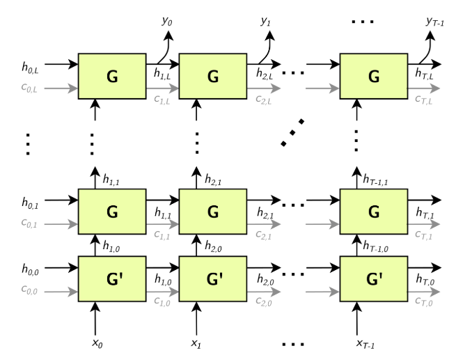
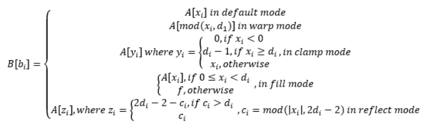

# TensorRT网络层详解


[点击此处加入NVIDIA开发者计划](https://developer.nvidia.com/zh-cn/developer-program)

## A.1. TensorRT Layers

在 TensorRT 中，层代表了不同风格的数学或编程操作。以下部分描述了 TensorRT 支持的每一层。 TensorRT 所需的最小工作空间取决于网络使用的算子。建议的最小构建时间设置为 16 MB。无论提供给构建器的最大工作空间值如何，TensorRT 都将在运行时分配不超过它所需的工作空间。要查看每个层支持的特定属性列表，请参阅[NVIDIA TensorRT API 参考文档](https://docs.nvidia.com/deeplearning/sdk/tensorrt-api/index.html)。

TensorRT 可以通过[融合层](https://docs.nvidia.com/deeplearning/tensorrt/developer-guide/index.html#fusion-types)来优化性能。有关如何启用层融合优化的信息，请参阅融合类型。有关优化单个层性能的信息，请参阅[优化层性能](https://docs.nvidia.com/deeplearning/tensorrt/developer-guide/index.html#optimize-layer)。

有关每层支持的精度类型和功能的详细信息，请参阅[NVIDIA TensorRT 支持矩阵](https://docs.nvidia.com/deeplearning/sdk/tensorrt-support-matrix/index.html)。


### A.1.1. IActivationLayer

`IActivationLayer`实现元素激活函数。

**层描述**

对输入张量A应用激活函数，并生成具有相同维度的输出张量B。

激活层支持以下操作：

```
rectified Linear Unit (ReLU): B = ReLU(A)
Hyperbolic tangent: B = tanh(A)
“s” shaped curve (sigmoid): B = σ(A)
```

**条件和限制**

没有任何

请参阅[C++ 类IActivationLayer](https://docs.nvidia.com/deeplearning/sdk/tensorrt-api/c_api/classnvinfer1_1_1_i_activation_layer.html)或[Python 类IActivationLayer](https://docs.nvidia.com/deeplearning/sdk/tensorrt-api/python_api/infer/Graph/Layers.html#iactivationlayer) 。


### A.1.2. IAssertionLayer

如果`IAssertionLayer `的输入张量包含任何错误值，则`IAssertionLayer`会导致构建器或运行时报告错误。

**层描述**

该层有一个布尔输入张量，没有输出。输入张量必须是形状张量。如果构建器可以证明任何元素在构建时始终为假，则会报告构建时错误。否则，在运行时计算张量，如果任何元素为假，则报告错误。

Assert输入维度相等可能有助于优化器。例如，如果网络有两个前导维度必须相等的输入，则使用`IGatherLayer` （或`ISliceLayer` ）提取这些维度，将它们与`ElementWiseOperation::kEQUAL`进行比较，并将输出馈送到`IAssertionLayer`让 TensorRT 知道维度必须相等。

**条件和限制**

输入张量必须是布尔形状张量。

请参阅[C++ 类IAssertionLayer](https://docs.nvidia.com/deeplearning/sdk/tensorrt-api/c_api/classnvinfer1_1_1_i_assertion_layer.html)或[Python 类IAssertionLayer](https://docs.nvidia.com/deeplearning/sdk/tensorrt-api/python_api/infer/Graph/Layers.html#iassertionlayer) 。


### A.1.3. IConcatenationLayer

`IConcatenationLayer`将多个具有相同非通道大小的张量沿通道维度链接在一起。

**层描述**

m个输入张量$A^i$和通道轴c的数组中传递。

所有输入张量的所有维度必须在除轴c之外的每个轴上匹配。让每个输入张量都有维度$a^i$ 。连接的输出张量将具有维度b使得

$b_j =\{a_j\ \ \ if \ \ j≠c\ \ \ and\ \ \ \sum {m−1\atop i=0}\ a{i\atop c} \ \ otherwise\}$

**条件和限制**

如果非批处理轴少于三个，则默认通道轴假定为最后一个轴的第三个或第一个非批处理轴。使用隐式批处理维度模式时，无法沿批处理轴进行连接。所有输入张量必须是非 `INT32` 类型，或者都必须是 `INT32` 类型。

请参阅[C++ 类IConcatenationLayer](https://docs.nvidia.com/deeplearning/sdk/tensorrt-api/c_api/classnvinfer1_1_1_i_concatenation_layer.html)或[Python 类IConcatenationLayer](https://docs.nvidia.com/deeplearning/sdk/tensorrt-api/python_api/infer/Graph/Layers.html#iconcatenationlayer) 。


### A.1.4. IConditionLayer

`IConditionLayer`表示与 Conditional 构造关联的条件边界。它由 TensorRT 在使用`IIfConditional::setCondition`时创建。 if-conditional 由条件边界层定义。

**层描述**

`IConditionLayer`只有一个输入，它接受一个布尔张量，该张量控制与此`IConditionLayer`关联的 Conditional 的评估流。

**条件和限制**

`IConditionLayer`的输入必须是布尔标量（零维张量）。

请参阅[C++ 类IConditionLayer](https://docs.nvidia.com/deeplearning/sdk/tensorrt-api/c_api/classnvinfer1_1_1_i_condition_layer.html)或[Python 类IConditionLayer ](https://docs.nvidia.com/deeplearning/sdk/tensorrt-api/python_api/infer/Graph/Layers.html#iconditionlayer)。

### A.1.5. IConstantLayer

`IConstantLayer`输出一个张量，其值作为该层的参数提供，从而可以方便地在计算中使用常量。

**层描述**

给定维度`d`和权重向量`w` ，Constant层将输出维度为d的张量B ，其中常数值在w中。该层不接受输入张量。权重向量`w`中的元素数量等于`d`的volume。

**条件和限制**

输出可以是零到七维的张量。不支持布尔权重。

请参阅[C++ 类IConstantLayer](https://docs.nvidia.com/deeplearning/sdk/tensorrt-api/c_api/classnvinfer1_1_1_i_constant_layer.html)或[Python 类IConstantLayer](https://docs.nvidia.com/deeplearning/sdk/tensorrt-api/python_api/infer/Graph/Layers.html#iconstantlayer) 。


### A.1.6. IConvolutionLayer

`IConvolutionLayer`计算带或不带偏差的2D（通道、高度和宽度）卷积或 3D（通道、深度、高度和宽度）卷积。

注意： `IConvolutionLayer`执行的操作实际上是一个correlation。因此，如果您正在格式化权重以通过 API 而不是通过解析器导入，这是一个考虑因素。

**层描述：2D卷积**

4D tensor A上计算与 2D filters 的互相关，尺寸为 a ，以生成 4D 张量B ，尺寸为b 。 B的维度取决于A的维度、输出映射的数量m 、内核大小k 、对称填充p 、步幅s 、扩张d和扩张内核大小 $t = 1+d (k−1)$ ，因此高度和宽度相应调整如下：

* $b =[a_0\ \ \ m\ \ \  b_2\ \ \  b_3]$ 
* $b_2 =⌊ (a_2+2p_0−t_0)/s_0⌋ + 1$
* $b_3 =⌊ (a_3+2p_1−t_1)/s_1⌋ + 1$

`g`的核权重`w`和偏置权重`x` （可选）如下：
* w根据形状 $[m\ a_1/g\ r_0\ r1]$排序
* x的长度为m

让张量K尺寸为$k = [m\ a_1/g\  t_0\  t_1]$被定义为零填充张量，使得：

* $k_{i, j, {hh}, {ll}}= w_{i, j, h, l}$

* $hh = \{0\ \ \ if\  \ \ h = 0, h + d_0 \ \ (h−1) \ \ otherwise\}$

* $ll = \{0\ \  if\ \  l = 0, l + d_1 (l−1) \ \ otherwise\}$

张量C是A的零填充副本，尺寸为$[a_0\ \  a_1\ \  a_2+p_0 \ \ a_3+p_1]$，则张量B定义为

$B_{i, j, k, l}=\sum(C_{i, :, k:kk, l:ll}× K_{j, :, :, :}) +x_j\ \ \ where\ \  kk = k+t_0−1\ \  and\ \  ll = l+t_1−1$


**层描述：3D卷积**

5D tensor A上计算与 3D filter的互相关，以产生尺寸为b的5D 张量B。 B的维度取决于A的维度、输出映射的数量m 、内核大小k 、对称填充p 、步幅s 、扩张d和扩张内核大小$t = 1+d (k−1)$，因此高度和宽度相应调整如下：

* $b =[a_0\ m \ b_2\  b_3\  b_4]$
* $b_2 = (a_2+2p_0−t_0)/s_0+1$
* $b_3 = (a_3+2p_1−t_1)/s_1+1$
* $b_4 = (a_4+2p_2−t_2)/s_1+1$

g的核权重`w`和偏置权重`x` （可选）如下：

* `w`根据形状$[m\ a_1/g\  r_0\  r_1\  r_2]$排序
* `x`的长度为`m`

让张量K尺寸为$k = [m\  a_1/g\  t_0\  t_1\  t_2]$ 被定义为零填充张量，使得：

* $k_{i, j, dd, hh, ll}= w_{i, j, d, h, l}$ 
* $dd = \{0\ \  if\ \  d = 0, d + d_0\ \  (d−1)\ \  otherwise\}$
* $hh = \{0\  if\  \ h = 0, h + d_1\ \  (h−1) \ otherwise\}$
* $ll = \{0\ \  if\ \  l = 0, l + d_2\ \  (l−1)\ \  otherwise\}$

张量C是A的零填充副本，尺寸为$[a_0 \ \ a_1\ \  a_2+p_0 \ \ a_3+p_1 \ \ a_4+p_2]$ 

则张量B定义为

$B_{i, j, d, k, l}=\sum(C_{i, :, d:dd, k:kk, l:ll} × K_{j, :, :, :, :}) +x_j \ \  where\ \  dd = d+t_0−1 , kk = k+t_1−1 , and\ \  ll = l+t_2−1$ .

**条件和限制**

输入内核维度的数量决定了 2D 或 3D。对于 2D 卷积，输入和输出可能有四个以上的维度；超过四个，所有维度都被视为批量大小的乘数，输入和输出被视为 4D 张量。对于 3D 卷积，类似于 2D 卷积，如果输入或输出的维度超过 5 个，则所有超过 5 个维度都被视为批量大小的乘数。如果指定了组并且使用了 INT8 数据类型，则输入和输出的组大小必须是四的倍数。

**空张量**

与零输入通道（例如[n, 0, h, w] ）的卷积会导致维度为[n, k, p, q]的零张量，因为结果的每个元素都是对一组空的乘积求和。

请参阅[C++ 类IConvolutionLayer](https://docs.nvidia.com/deeplearning/sdk/tensorrt-api/c_api/classnvinfer1_1_1_i_convolution_layer.html)或[Python 类IConvolutionLayer](https://docs.nvidia.com/deeplearning/sdk/tensorrt-api/python_api/infer/Graph/Layers.html#iconvolutionlayer) 。


### A.1.7. IDeconvolutionLayer

`IDeconvolutionLayer`计算带或不带偏差的2D（通道、高度和宽度）或 3D（通道、深度、高度和宽度）反卷积。

注意：该层实际上在 2D/3D 输入上应用了 2D/3D 转置卷积算子。它也被称为分数步幅卷积或转置卷积。

**层描述：2D反卷积**

4D tensor A上计算与 2D filter的互相关，尺寸为 a ，以生成 4D 张量B ，尺寸为b 。 B的维度取决于A的维度、输出映射的数量m 、内核大小k 、对称填充p 、步幅s 、扩张d和扩张内核大小$t = 1+d (k−1)$ ，因此高度和宽度相应调整如下：

* $b =[a_0\ m\  b_2\  b_3]$ 
* $b_2 = (a_2−1)*s_0 + t_0 − 2p_0$
* $b_3 = (a_3−1)*s_1 + t_1 − 2p_1$

`g`的核权重`w`和偏置权重`x` （可选）如下：

* w是根据形状$[a_1/g\  m\  r_0\  r_1]$排序
* x的长度为m

让张量K尺寸为$k = [m\  b_1/g\  t_0\  t_1]$被定义为零填充张量，使得：

* $k_{i, j, hh, ll}= w_{i, j, h, l}$
* $hh = \{0\ \  if\ \  h = 0, h + d_0 (h−1)\ \  otherwise\}$
* $ll = \{0\ \  if\ \  l = 0, l + d_1 (l−1) \ \ otherwise\}$

张量`C`是`A`的零填充副本，尺寸为 $[a_0 \ a_1 \ a_2+p_0\  a_3+p_1]$ , 则张量B定义为

$B_{i, j, k, l}=\sum _{u, v} (C_{i, j, k-u, l-v} \ K) +x_j$

其中u范围从0到 $min (t_0-1, k)$ , v范围从0到$min (t_1-1, l)$ 。


**层描述：3D反卷积**

5D tensor A上计算与 3D filter 的互相关，以产生尺寸为b的5D 张量B。 B的维度取决于A的维度、输出映射的数量m 、内核大小k 、对称填充p 、步幅s 、扩张d和扩张内核大小$t = 1+d (k−1)$ ，因此高度和宽度相应调整如下：

* $b =[a_0\ m\  b_2\  b_3]$ 
* $b_2 = (a_2−1)*s_0 + t_0 − 2p_0$
* $b_3 = (a_3−1)*s_1 + t_1 − 2p_1$
* $b_4 = (a_4−1) *s_2 +t_2 −2p_2$

`g`的核权重`w`和偏置权重`x` （可选）如下：

* w是根据形状$[a_1/g\  m\  r_0\  r_1\ r_2]$排序
* x的长度为m

让张量K尺寸为$k = [m\  b_1/g\  t_0\  t_1\ t_2]$被定义为零填充张量，使得：

* $k_{i, j, dd, hh, ll}= w_{i, j, d, h, l}$
* $dd = \{0 \ \ if\ \  d = 0, d + d_0 (d−1) \ \ otherwise\}$
* $hh = \{0\ \  if\ \  h = 0, h + d_1 (h−1)\ \  otherwise\}$
* $ll = \{0\ \  if\ \  l = 0, l + d_2 (l−1) \ \ otherwise\}$

张量`C`是`A`的零填充副本，尺寸为 $[a_0 \ a_1 \ a_2+p_0\  a_3+p_1\  a_4+p_2]$ , 则张量B定义为

$B_{i, j, k, l, m}=\sum _{u, v, w} (C_{i, j, k-u, l-v, m-w} \ K) +x_j$

其中u范围从0到 $min (t_0-1, k)$ , v范围从0到$min (t_1-1, l)$, 其中w范围从0到 $min (t_2-1, m)$ 

**条件和限制**

2D 或 3D 由输入内核维度的数量决定。对于 2D 反卷积，输入和输出可能有超过 4 个维度；超过 4，所有维度都被视为批量大小的乘数，输入和输出被视为 4D 张量。对于 3D 反卷积，类似于 2D 反卷积，超过 5 的维度被视为批量大小的乘数。如果指定了组并且使用了 INT8 数据类型，则输入和输出组的大小必须是 4 的倍数。

请参阅[C++ 类IDeconvolutionLayer](https://docs.nvidia.com/deeplearning/sdk/tensorrt-api/c_api/classnvinfer1_1_1_i_deconvolution_layer.html)或[Python 类IDeconvolutionLayer](https://docs.nvidia.com/deeplearning/sdk/tensorrt-api/python_api/infer/Graph/Layers.html#ideconvolutionlayer) 。


### A.1.8. IDequantizeLayer
`DequantizeLayer`实现反量化运算符。

**层描述**

`IDequantizeLayer`层接受带符号的 8 位整数输入张量，并使用配置的比例和零点输入根据以下公式对输入进行反量化：

`output = (input - zeroPt) * scale`

第一个输入（索引 0 ）是要量化的张量。第二个输入（索引 1 ）和第三个输入（索引 2 ）分别是刻度和零点。

请参阅[C++ 类IDequantizeLayer](https://docs.nvidia.com/deeplearning/sdk/tensorrt-api/c_api/classnvinfer1_1_1_i_dequantize_layer.html)或[Python 类IDequantizeLayer](https://docs.nvidia.com/deeplearning/sdk/tensorrt-api/python_api/infer/Graph/Layers.html#idequantizelayer) 。


### A.1.9. IEinsumLayer

`IEinsumLayer`实现了一个 `Einsum` 运算符。

**层描述**

`IEinsumLayer`根据`Einstein` 求和约定，沿方程参数指定的维度对输入元素进行求和。
* 该等式以与维度相同的顺序为输入中的每个维度指定 ASCII 小写字母，每个输入用逗号分隔。
* 该等式表示为term1,term2...->output-term ，其中每个项对应于一个操作数张量，项内的字符对应于操作数维度。
* 标有相同下标的尺寸必须匹配。
* 一个输入中的重复下标标签采用对角线。
* 跨多个输入重复标签意味着这些轴将成倍增加
* 从输出中省略标签意味着沿这些轴的值将被求和。
* 对于某些输入操作数，输出下标必须至少出现一次，而对于输出则至多出现一次。
* 在隐式模式下，即如果等式不包含-> ，则表达式中出现一次的索引将成为按字母顺序递增的输出的一部分。
* 在显式模式下，可以通过添加箭头 ( -> ) 后跟输出下标来指定输出下标标签来控制输出。例如， `ij,jk->ik`等价于`ij,jk` 。
* 空字符串 ("") 对标量操作数有效。
* 该等式可能在不同元素（下标、省略号、箭头和逗号）之间包含空格（`SPC-0x20`）。


**条件和限制**

TensorRT 不支持 `Einsum` 的省略号、对角线运算或两个以上的输入。所有输入必须具有相同的数据类型，并且该数据类型必须是`DataType::kFLOAT`或`DataType::kHALF` 。

请参阅[C++ 类IEinsumLayer](https://docs.nvidia.com/deeplearning/sdk/tensorrt-api/c_api/classnvinfer1_1_1_i_einsum_layer.html)或[Python 类IEinsumLayer ](https://docs.nvidia.com/deeplearning/sdk/tensorrt-api/python_api/infer/Graph/Layers.html#ieinsumlayer)。


### A.1.10. IElementWiseLayer

`IElementWiseLayer`也称为 `Eltwise` 层，实现了每个元素的操作。

**层描述**

该层计算输入张量A和输入张量B之间的每元素二元运算，以产生输出张量C 。对于每个维度，它们的长度必须匹配，或者其中一个必须是一个。在后一种情况下，张量沿该轴广播。输出张量与输入具有相同的维数。输出张量与输入具有相同的维数。对于每个输出维度，如果它们匹配，则其长度等于相应输入维度的长度；否则，它等于对应的输入维度不是一。

`IElementWiseLayer`支持以下操作：

```
Sum: C = A+B
Product: C = A*B
Minimum: C = min(A, B)
Maximum: C = max(A, B)
Subtraction: C = A-B
Division: C = A/B
Power: C = A^B
Floor division : C = floor(A/B)
And : C = A & B
Or : C = A | B
Xor : C = A xor B
Equal : C = (A == B)
Greater : C = A > B
Less: C = A < B
```
**条件和限制**

A和B的每个维度的长度必须等于或等于 1。

`IElementWiseLayer`层可以接受不同的输入数据类型，具体取决于所使用的操作。 `IElementWiseLayer`支持每个操作的以下类型：
```
| Operation   | DataTypes                    |
| ----------- | ---------------------------- |
| kSUM        | kFLOAT, kHALF, kINT8, kINT32 |
| kPROD       | kFLOAT, kHALF, kINT8, kINT32 |
| kMAX        | kFLOAT, kHALF, kINT8, kINT32 |
| kMIN        | kFLOAT, kHALF, kINT8, kINT32 |
| kSUB        | kFLOAT, kHALF, kINT8, kINT32 |
| kDIV        | kFLOAT, kHALF, kINT8, kINT32 |
| kPOW        | kFLOAT, kHALF, kINT8         |
| kFLOOR\_DIV | kFLOAT, kHALF, kINT8, kINT32 |
| kAND        | kBOOL                        |
| kOR         | kBOOL                        |
| kXOR        | kBOOL                        |
| kEQUAL      | kFLOAT, kHALF, kINT8, kINT32 |
| kGREATER    | kFLOAT, kHALF, kINT8, kINT32 |
| kLESS       | kFLOAT, kHALF, kINT8, kINT32 |
```
请参阅[C++ 类IElementWiseLayer](https://docs.nvidia.com/deeplearning/sdk/tensorrt-api/c_api/classnvinfer1_1_1_i_element_wise_layer.html)或[Python 类IElementWiseLayer](https://docs.nvidia.com/deeplearning/sdk/tensorrt-api/python_api/infer/Graph/Layers.html#ielementwiselayer) 。


#### A.1.10.1. ElementWise Layer Setup

ElementWise 层用于执行完全连接层提供的功能的第二步。 `fcbias`常数层和矩阵乘法层的输出用作 `ElementWise` 层的输入。然后将该层的输出提供给 `TopK` 层。下面的代码演示了如何设置图层：
```C++
auto fcbias = network->addConstant(Dims2(VOCAB_SIZE, 1), weightMap[FCB_NAME]);
auto addBiasLayer = network->addElementWise(
*matrixMultLayer->getOutput(0), 
*fcbias->getOutput(0), ElementWiseOperation::kSUM);
assert(addBiasLayer != nullptr);
addBiasLayer->getOutput(0)->setName("Add Bias output");
```
有关详细信息，请参阅[NVIDIA TensorRT API 参考](http://docs.nvidia.com/deeplearning/sdk/tensorrt-api/index.html)。

### A.1.11. IFillLayer

`IFillLayer`用于生成具有指定模式的输出张量。

**层描述**

给定输出张量大小，该层将生成具有指定模式的数据并填充张量。 `alpha `和 `beta` 作为不同模式的不同参数执行。

IFillLayer支持以下操作：
* LINSPACE ：Output = alpha(scalar) + beta(different on each axis) * element_index
* RANDOM_UNIFORM ：Output = Random(min = alpha, max = beta)

**条件和限制**

如果使用静态张量大小，该层只能生成一维张量。使用动态张量大小时，`alpha` 和 `beta` 的尺寸应符合每种模式的要求。

请参阅[C++ 类IFillLayer](https://docs.nvidia.com/deeplearning/sdk/tensorrt-api/c_api/classnvinfer1_1_1_i_fill_layer.html)或[Python 类IFillLayer](https://docs.nvidia.com/deeplearning/sdk/tensorrt-api/python_api/infer/Plugin/IPluginV2Ext.html) 。


### A.1.12. IFullyConnectedLayer

`IFullyConnectedLayer`实现了一个矩阵向量乘积，有或没有偏差。

**层描述**

`IFullyConnectedLayer`需要三个或更多维度的输入张量A。给定一个尺寸为$a=[a_0 ... a_{n−1}]$ ,  它首先被重新整形为尺寸为 $a^′=[a_0 ... a_{n−4} (a_{n−3}*a_{n−2}*a_{n−1})]$ 将最后三个维度压缩为一个维度。

然后，该层执行操作$B^′=WA^′+X$, 其中W是维度$w=[(a_{n−3}*a_{n−2}*a_{n−1}) k]$  , X是沿其他维度广播的维度$x=(k)$ 的偏置张量, k是输出通道，通过`setNbOutputChannels()`配置。如果未指定`X` ，则偏差值隐含为`0` 。结果$B'$是一个尺寸为$b^′=[a_0 ... a_{n−4} k]$的张量

最后，将$B'$重新整形为尺寸为$b=[a_0 ... a_{n−4} k \ 1 \ 1]$ 通过插入两个尺寸为1的较低维度。

总之，对于尺寸为 $a=[a_0 ... a_{n−1}]$ ,输出张量B的维度为$b=[a_0 ... a_{n−4} k\ 1 \ 1]$

**条件和限制**

A必须具有三个或更多维度。

请参阅[C++ 类IFullyConnectedLayer](https://docs.nvidia.com/deeplearning/sdk/tensorrt-api/c_api/classnvinfer1_1_1_i_fully_connected_layer.html)或[Python 类IFullyConnectedLayer](https://docs.nvidia.com/deeplearning/sdk/tensorrt-api/python_api/infer/Graph/Layers.html#ifullyconnectedlayer) 。


### A.1.13. IGatherLayer

`IGatherLayer`实现了聚合操作的三种变体。

**层描述**

默认聚合模式： `IGatherLayer`的`kDEFAULT`模式使用零维或更多维的索引张量B沿指定轴x收集每个数据张量A的元素，以生成尺寸为c的输出张量C。

如果B有零维并且它是一个标量b ，那么$c_k = \{a_k\ if\  k<x, and\  a_{k+1}\  if\  k<x\}$, 并且c的长度等于 a 的长度减一。在这种情况下，$C_i = A_j \ \ \  where\ \ \  j_k = \{b\ \  if\ \  k=x, i_k \ \ if\ \  k<x, \ and \ \ i_{k−1} if k>x\}$。

如果B是维度为b的张量（长度为b ），则$c_k = \{a_k\ \  if\ \  k<x, b_{k−x}\ \  if\ \  k≥x\ \  and\ \  k<x+b, \ and \ \ a_{k−b+1}\ \  otherwise\}$。在这种情况下， $C_i\  =\  A_j \ \  where\ \  j_k = \{B_{X(i)}\ \  if \ \ k=x, i_k\ \  if\ \  k<x, and\ \  i_{k−b}\ \  if\ \  k>x\}\ \  and\ \  X(i)=i_{x, .., x+b−1}$ 。


`GatherND` 模式： `IGatherLayer`的`GatherMode ::kND`模式使用维度b的索引张量B收集维度a的数据张量A的元素，以产生维度c的输出C。

让我们表示输入张量的形状如:
$shape (A) = [f_1, ... f_a], shape (B) = [g_1, ... g_{b−1}, k]$。 让我们将元素维度的数量表示为n 。那么， $c = a + b − k − 1 − n$

* If $k = a − n$
    * $shape (C) = [g_1, ... g_{b−1}]$
    * $C (i_1 ... i_{n−1}, i_n, ... i_{b−1})  = A (i_1 ... i_{n−1}, B (i_1, ... i_{b−1}))$
* If $k < a − n$
    * $shape (C) = [g_1, ... g_{b−1}, f_{n+k+1}, ... f_a]$
    * $C (i_1, ... i_{n−1}, i_n, ... i_{a−1}, i_a, ... i_{a+b-k-1-n})  = A (i_1, ... i_{n−1}, B (i_{1, ... ib−1}), i_b, ... i_{a+b-k-1-n})$
    * where $B (i_1, ... i_{b−1})$ is a tensor with k dimensions, and $shape (B (i_1, ... i_{b−1})) = [i_n, ... i_{n+k+1}]$ .
* If k > a − n
    * This is a build time error.

`GatherElements` 模式： `IGatherLayer`的`GatherMode ::kELEMENT`模式使用维度b的索引张量B在指定轴上收集维度a的数据张量A的元素，以产生维度c的输出C。

输出C具有形状$shape (C) = shape (B)$ 。以下伪代码说明了如何计算C。

```C++
For each element X of B:
Let J denote a sequence for the subscripts of X
Let K = sequence J with element [axis] replaced by X
C[J] = A[K]
```

**条件和限制**

* 索引张量B必须仅包含 INT32 值。
* 如果索引张量中有任何无效的索引元素，则零将存储在输出张量中的适当位置。
* A的轴具有动态长度，则对其使用负索引具有未定义的行为。

Default Gather Mode：适用于隐式批处理模式：
* 不能沿批量大小维度收集元素。
* 数据张量A必须至少包含一个非批量维度。
* 数据张量A必须至少包含轴+ 1 个非批量维度。
* 参数轴是零索引的，从数据张量A的第一个非批量维度开始。


适用于显式批处理模式：
* 数据张量A必须至少包含一维。
* 数据张量A必须至少包含轴+ 1 个维度。
* 参数轴是零索引的，从数据张量A的第一维开始。
* 轴必须大于或等于`IGatherLayer::setNbElementWiseDimensions()`设置的元素维度数。
* ElementWise 维度的数量只能设置为 0 或 1。
* 如果 ElementWise 维数设置为 1，则行为将类似于隐式批处理模式。前导维度将被视为隐式批处理模式中的批处理维度，这不是收集操作的一部分。例如，数据张量A的维度为`[N, C, H, W]` ，索引张量B的维度为`[N, K]` 。如果`nbElementWiseDimensions`为 1 并且轴设置为 1，则结果的维度将为`[N, K, H, W]` 。如果`nbElementWiseDimensions`为 0 并且轴设置为 1，则结果的维度将为`[N, N, K, H, W]` 。
* ElementWise 维度支持像IElementWiseLayer这样的广播。

GatherND Mode：
* 数据张量A必须至少包含一维。
* 索引张量B必须至少包含一维。
* A和B的前n 个维度必须相等，其中n是元素维度的数量。
* n必须小于A的维数和B的维数。
* B的最里面的维度应该有一个介于1和a - n之间的值，包括 1 和 a - n 。

GatherElements Mode：
* 数据张量A必须至少包含一维。
* 索引张量B必须至少包含一维。
* 轴必须介于0和-1之间，包括在内。

请参阅[C++ 类IGatherLayer](https://docs.nvidia.com/deeplearning/sdk/tensorrt-api/c_api/classnvinfer1_1_1_i_gather_layer.html)或[Python 类IGatherLayer](https://docs.nvidia.com/deeplearning/sdk/tensorrt-api/python_api/infer/Graph/Layers.html#igatherlayer) 。

### A.1.14. IIdentityLayer

`IIdentityLayer`实现identity操作。

**层描述**

该层的输出在数学上与输入相同。该层允许您精确控制张量的精度并从一种精度转换为另一种精度。如果输入的精度与输出的精度不同，则该层会将输入张量转换为输出精度。

**条件和限制**

没有任何

请参阅[C++ 类IIdentityLayer](https://docs.nvidia.com/deeplearning/sdk/tensorrt-api/c_api/classnvinfer1_1_1_i_identity_layer.html)或[Python 类IIdentityLayer](https://docs.nvidia.com/deeplearning/sdk/tensorrt-api/python_api/infer/Graph/Layers.html#iidentitylayer) 。


### A.1.15. IIfConditionalBoundaryLayer

`IIfConditionalBoundaryLayer`是 if 条件相关层的基类，特别是`IConditionLayer` 、 `IIfConditionalOutputLayer`和`IIfConditionalInputLayer` 。 `if-conditional` 由条件边界层定义。

**层描述**

`IIfConditionalBoundaryLayer`类定义了一个虚拟方法`getConditional()` ，它返回一个指向关联`IIfConditional`的指针。

**条件和限制**

没有任何

有关`IIfConditionalBoundaryLayer`的更多信息，包括条件如何工作及其限制，请参阅[使用条件](https://docs.nvidia.com/deeplearning/tensorrt/developer-guide/index.html#work-with-conditionals)。

### A.1.16. IIfConditionalOutputLayer

`IfConditionalOutputLayer`指定 if 条件的输出。 if-conditional 由条件边界层定义。

**层描述**

`if-conditional` 必须有一个或多个输出，每个输出由`IfConditionalOutputLayer`的唯一实例定义。 `IfConditionalOutputLayer`正好有两个输入，一个来自真分支（then-branch），一个来自假分支（else-branch）。当 if-conditional 执行`IfConditionalOutputLayer`时，它会根据与 if-conditional 关联的条件值选择两个输入中的哪一个复制到输出。

**条件和限制**

必须恰好有两个输入和一个输出。

有关IfConditionalOutputLayer的更多信息，包括条件如何工作及其限制，请参阅[使用条件](https://docs.nvidia.com/deeplearning/tensorrt/developer-guide/index.html#work-with-conditionals)。

### A.1.17. IIfConditionalInputLayer

`IfConditionalInputLayer`指定 if 条件的输入。 `if-conditional` 由条件边界层定义。

**层描述**

`IfConditionalInputLayer`是 `if-conditional` 输入的占位符，可由 if-conditional 的一个或两个分支使用。 `IfConditionalInputLayer`划分了 if 条件的输入边界。

**条件和限制**

必须只有一个输入和一个输出。

有关`IfConditionalOutputLayer`的更多信息，包括条件如何工作及其限制，请参阅[使用条件](https://docs.nvidia.com/deeplearning/tensorrt/developer-guide/index.html#work-with-conditionals)。

### A.1.18. IIteratorLayer
`IIteratorLayer`使循环能够迭代张量。循环由循环边界层定义。

有关`IIteratorLayer`的更多信息，包括循环的工作方式及其限制，请参阅[使用循环](https://docs.nvidia.com/deeplearning/sdk/tensorrt-developer-guide/index.html#work-with-loops)。

请参阅[C++ 类IIteratorLayer](https://docs.nvidia.com/deeplearning/sdk/tensorrt-api/c_api/classnvinfer1_1_1_i_loop_boundary_layer.html)或[Python 类IIteratorLayer](https://docs.nvidia.com/deeplearning/sdk/tensorrt-api/python_api/infer/Graph/Layers.html#iloopboundarylayer) 。

### A.1.20. ILoopOutputLayer

`ILoopOutputLayer`指定循环的输出。循环由循环边界层定义。

有关`ILoopOutputLayer`的更多信息，包括循环的工作方式及其限制，请参阅使用循环。

请参阅[C++ 类ILoopOutputLayer](https://docs.nvidia.com/deeplearning/sdk/tensorrt-api/c_api/classnvinfer1_1_1_i_loop_output_layer.html)或[Python 类ILoopOutputLayer](https://docs.nvidia.com/deeplearning/sdk/tensorrt-api/python_api/infer/Graph/Layers.html#iloopboundarylayer) 。


### A.1.21. ILRNLayer

`ILRNLayer`实现跨通道本地响应归一化（LRN） 。

**层描述**

给定输入A ，LRN 层执行跨通道 LRN 以产生相同维度的输出B。该层的操作取决于四个常数值： w是进行归一化的跨通道窗口的大小， α 、 β和k是归一化参数。这个公式显示了层执行的操作：
$BI=\frac{A_I}{(k+aA_j(I)^2)β}$

其中I表示张量元素的索引，而$j(I)$表示通道维度被j替换的索引。对于C个通道的通道索引c ，索引j的范围从$max (0, c−w)$到$min (C−1, c+w)$   。

**条件和限制**

A必须具有三个或更多维度。以下列表显示了参数的可能值：

$W ϵ\{1, 3, 5, 7, 9, 11, 13, 15\}$

$α ϵ[­1 ×10^{20}, 1 ×10^{20}]$

$β ϵ[0.01, 1 ×10^5]$

$k ϵ[1 × 10­^5, 1 ×10^{10}]$

请参阅[C++ 类ILRNLayer](https://docs.nvidia.com/deeplearning/sdk/tensorrt-api/c_api/classnvinfer1_1_1_i_l_r_n_layer.html)或[Python 类ILRNLayer](https://docs.nvidia.com/deeplearning/sdk/tensorrt-api/python_api/infer/Graph/Layers.html#ilrnlayer) 。


### A.1.22. IMatrixMultiplyLayer

`IMatrixMultiplyLayer`为一组矩阵实现矩阵乘法。

**层描述**

`IMatrixMultiplyLayer`计算输入张量A （尺寸为 a ）和B （尺寸为b ）的矩阵乘法，并生成输出张量C （尺寸为c ）。 A 、 B和C都具有相同的秩 `n≥2` 。如果 `n>2` ，则A 、 B和C被视为矩阵的集合； A和B可以选择转置（转置应用于最后两个维度）。令$A^I$和$B^I$为可选转置后的输入张量，则

$C_{i_0, . . , i_{n-3}, :, :}=A^I_{i_0, . ., i_{n−3}, :, :}*B^I_{i_0, . ., i_{n−3}, :, :}$

$A^I$ 和$B^I$的对应维度$a^I$和$b^I$ ，则 $C_i=\{max(a_i,b_i)\ \ \ if\ \ \  i<n−2, a^I_i\ \ \  if\ \ \  i=n−2, and\ \ \  b^I_i \ \ \ if\ \ \  i=n−1\}$; 也就是说，结果集合与输入集合具有相同数量的矩阵，并且行和列对应于$A^I$中的行和$B^I$中的列。还要注意在维度上广播的情况下使用最大长度。


**条件和限制**

张量A和B必须至少有两个维度，并且在维度的数量上达成一致。每个维度的长度必须相同，假设广播长度为 1 的维度以匹配对应的长度。

请参阅[C++ 类IMatrixMultiplyLayer](https://docs.nvidia.com/deeplearning/sdk/tensorrt-api/c_api/classnvinfer1_1_1_i_matrix_multiply_layer.html)或[Python 类IMatrixMultiplyLayer](https://docs.nvidia.com/deeplearning/sdk/tensorrt-api/python_api/infer/Graph/Layers.html#imatrixmultiplylayer) 。

#### A.1.22.1. MatrixMultiply Layer Setup

矩阵乘法层用于执行全连接层提供的功能的第一步。如下面的代码所示，需要使用一个常量层，以便可以将全连接权重存储在引擎中。然后将常量和 RNN 层的输出用作矩阵乘法层的输入。 RNN 输出被转置，以便 MatrixMultiply 的维度有效。
```C++
weightMap["trt_fcw"] = transposeFCWeights(weightMap[FCW_NAME]);
auto fcwts = network->addConstant(Dims2(VOCAB_SIZE, HIDDEN_SIZE), weightMap["trt_fcw"]);
auto matrixMultLayer = network->addMatrixMultiply(
*fcwts->getOutput(0), false, *rnn->getOutput(0), true);
assert(matrixMultLayer != nullptr);
matrixMultLayer->getOutput(0)->setName("Matrix Multiplication output");

```
有关更多信息，请参阅[TensorRT API 文档](https://docs.nvidia.com/deeplearning/sdk/tensorrt-api/index.html)。

**空张量**

将维度为`[ m ,0]`和`[0, n ]`的矩阵相乘会得到维度为`[ m , n ]`的零矩阵。它是零，因为结果的每个元素都是空乘积集的总和。

`IFullyConnectedLayer` 本质上是一个矩阵乘法，因此适用类似的规则。

### A.1.23. IParametricReluLayer

`IParametricReluLayer`表示参数 `ReLU` 操作，这意味着 leaky ReLU，其中 x < 0 的斜率对于每个元素可能不同。

**层描述**

用户提供数据张量`X`和斜率张量`S` 。在每个元素处，如果`x ≥ 0 `，则该层计算`y = x` ，如果`x < 0 `则计算 `y = x∙s `。可以将斜率张量广播到数据张量的大小，反之亦然。

**条件和限制**

许多融合不支持参数化 ReLU；因此，性能可能比标准 ReLU 差。

请参阅[C++ 类IParametricReluLayer](https://docs.nvidia.com/deeplearning/sdk/tensorrt-api/c_api/classnvinfer1_1_1_i_parametric_re_l_u_layer.html)或[Python 类IParametricReluLayer](https://docs.nvidia.com/deeplearning/sdk/tensorrt-api/python_api/infer/Graph/Layers.html#iparametricrelulayer) 。

### A.1.24. IPaddingLayer

IPaddingLayer沿两个最里面的维度实现张量的空间零填充。

注意： IPaddingLayer在 TensorRT 8.2 中已弃用，并将在 TensorRT 10.0 中删除。使用`ISliceLayer`填充张量，支持新的非常量，反映填充模式和钳位，支持动态形状的填充输出。

**层描述**

`IPaddingLayer`沿两个最内层维度中的每一个向输入张量A填充零（或修剪边缘），并给出输出张量B 。每个维度上的填充可以是不同的，不对称的，并且可以是正的（导致张量的扩展）或负的（导致修剪）。二维开始和结束处的填充由二维向量x和y指定，分别用于前填充和后填充。

n维a的输入张量A ，输出B将具有n维b使得$b_i=\{x_0+a_n−2+y_0\ \ \ if\ \ \  i=n−2; x_1+a_n−1+y_1\ \ \  if\ \ \  i=n−1; and\ \ \  a_i\ \ \  otherwise\}$ 。

因此，如果$w_{n−2}<x_0 \ \ \ or\ \ \  x_0+a_{n−2}≤w_{n−2}\ \ \  or\ \ \  w_{n−1}<x_1\ \ \  or\ \ \  x_1+a_{n−2}≤w_{n−1}$，则$B_w$的值为零。否则，如果$z_{n−2}=w_{n−2}+x_0, z_{n−1}=w_{n−1}+x_1$, 则$B_w=A_z$。并且$z_i = w_i$对于所有其他维度i 。

条件和限制
* A必须具有三个或更多维度。
* 填充只能沿两个最里面的维度应用。
* 仅支持零填充。
  
请参阅[C++ 类IPaddingLayer](https://docs.nvidia.com/deeplearning/sdk/tensorrt-api/c_api/classnvinfer1_1_1_i_padding_layer.html)或[Python 类IPaddingLayer](https://docs.nvidia.com/deeplearning/sdk/tensorrt-api/python_api/infer/Graph/Layers.html#ipaddinglayer) 。

### A.1.25. IPluginV2Layer

`IPluginV2Layer`提供了通过对不受支持的层使用自定义实现来扩展 TensorRT 功能的能力。

**层描述**

`IPluginV2Layer`用于设置和配置插件。有关 API 的更多详细信息，请参阅[IPluginV2 API 说明](https://docs.nvidia.com/deeplearning/tensorrt/developer-guide/index.html#ipluginv2)。 TensorRT 还支持插件注册表，它是网络中所有插件的单一注册点。为了向注册表注册插件，请为您的插件实现IPluginV2类和IPluginCreator类。

**条件和限制**

没有任何

**空张量**

需要处理空张量的插件必须使用`IPluginV2Ext` 、 `IPluginV2IOExt`或`IPluginV2DynamicExt` 编写。

警告：空张量可以具有非空张量看不到的属性：

* volume为零
* 一个或多个步幅为零


零volume可能会破坏内核启动逻辑，因为一种常见的方法是设置与正在处理的volume成比例的 CUDA 块的数量。 CUDA 报告启动零块内核的错误。因此插件应该小心避免此类启动。

步长的计算应与非空张量相同。例如，给定一个尺寸为`[N,C,H,W]`的张量，对应于沿C轴的增量的内存表示的步幅为`H*W` 。如果H或W为零，则无关紧要。尽管确保您的代码不会除以可能为零的步幅或维度。例如，以下片段中的assertion 有可能在两个分区中都被零除：

```C++
int volume = N*C*H*W;
int cStride = H*W;
...
assert(C == volume/N/cStride);
```
对于某些插件，一个有效的策略是在所有输出为空的情况下使插件的方法入队提前返回，从而在考虑零长度维度的情况下不使其余逻辑复杂化。

请参阅[C++ 类IPluginV2Layer](https://docs.nvidia.com/deeplearning/sdk/tensorrt-api/c_api/classnvinfer1_1_1_i_plugin_v2_layer.html)或[Python 类IPluginV2Layer](https://docs.nvidia.com/deeplearning/sdk/tensorrt-api/python_api/infer/Graph/Layers.html#ipluginv2layer) 。

### A.1.26. IPoolingLayer

`IPoolingLayer`在通道内实现池化。支持的池化类型是`maximum` 、 `average`和`maximum-average blend` 。

**层描述：2D pooling**

张量A上使用 2D filters计算池化，尺寸为 a ，以生成张量B ，尺寸为b 。 B的尺寸取决于A的尺寸、窗口大小r 、对称填充p和步幅s ，使得：

* $b =[a_0\ \  a_1... a_{n−3} b_{n−2} b_{n−1}]$
* $b_{n−2} =( a_{n−2}+2p_0+ r_0) /s_0+1$
* $b_{n−1} =( a_{n−1}+2p_1+ r_1) /s_1+1$

让张量C是A的零填充拷贝，尺寸为$[a_0 a_1... a_{n−2}+2p_0 a_{n−1}+2p_1]$。 那么， $B_{j......kl}=func (C_{j... . k:kk l:ll})\ \ \   where\ \ \  kk = k+r_0−1\ \ \  and\ \ \  ll = l+r_1−1$.

其中func由池类型t之一定义：

PoolingType::kMAX

窗口中元素的最大值。

PoolingType::kAVERAGE

窗口中元素的平均值。

PoolingType::kMAX_AVERAGE_BLEND

最大和平均池的混合。最大池化和平均池化的结果与混合因子结合为`(1-blendFactor)*maximumPoolingResult + blendFactor*averagePoolingResult`以产生结果。 `blendFactor`可以设置为 0 到 1 之间的值。

默认情况下，平均池化是在池化窗口和填充输入之间的重叠处执行的。如果`Exclusive`参数设置为`true` ，则对池化窗口和未填充输入之间的重叠区域执行平均池化。

**层描述：3D池化**

尺寸为 a的张量A计算池化，以生成尺寸为b的张量B。 B的尺寸取决于A的尺寸、窗口大小r 、对称填充p和步幅s ，使得：

* $b =[a_0\ \  a_1... a_{n−4} b_{n−3} b_{n−2}b_{n−1}]$
* $b_{n−3} =( a_{n−3}+2p_0+ r_0) /s_0+1$
* $b_{n−2} =( a_{n−2}+2p_1+ r_1) /s_1+1$
* $b_{n−1} =( a_{n−1}+2p_2+ r_2) /s_2+1$

让张量C是A的零填充拷贝，尺寸为$[a_0 a_1... a_{n−3}+2p_0 a_{n−2}+2p_1a_{n−1}+2p_2]$。 那么， $B_{j......klm}=func (C_{j... . k:kk l:ll m:mm})\ \ \   where\ \ \  kk = k+r_0−1\ \ \  ll = l+r_1−1\ \ \ and\ \ \ mm = m+r_2−1$.

其中func由池类型t之一定义：

PoolingType::kMAX

窗口中元素的最大值。

PoolingType::kAVERAGE

窗口中元素的平均值。

PoolingType::kMAX_AVERAGE_BLEND

最大和平均池的混合。最大池化和平均池化的结果与混合因子结合为`(1-blendFactor)*maximumPoolingResult + blendFactor*averagePoolingResult`以产生结果。 `blendFactor`可以设置为 0 到 1 之间的值。

默认情况下，平均池化是在池化窗口和填充输入之间的重叠处执行的。如果`Exclusive`参数设置为true ，则对池化窗口和未填充输入之间的重叠区域执行平均池化。

**条件和限制**

输入内核维度的数量决定了 2D 或 3D。对于 2D 池化，输入和输出张量应该具有三个或更多维度。对于 3D 池化，输入和输出张量应该有四个或更多维度。

如果使用`PoolingType::kMAX`并且填充大小等于或大于任何维度上的窗口大小，则输出张量的边界（对应于完全位于输入张量之外的输入窗口）将填充`FP32/FP16` 的负无穷 ( `-inf` ) 或 INT8 的`-128` 。这可能会导致后续层中出现 NaN。

请参阅[C++ 类IPoolingLayer](https://docs.nvidia.com/deeplearning/sdk/tensorrt-api/c_api/classnvinfer1_1_1_i_pooling_layer.html)或[Python 类IPoolingLayer](https://docs.nvidia.com/deeplearning/sdk/tensorrt-api/python_api/infer/Graph/Layers.html#iquantizelayer) 。


A.1.27. IQuantizeLayer
此`IQuantizeLayer`层实现量化运算符。

**层描述**

`IQuantizeLayer`层接受浮点数据输入张量，并使用比例和零点输入将数据量化为 8 位有符号整数，根据：

`output = clamp(round(input / scale) +  zeroPt)`

舍入类型是舍入到最近的 `tie-to-even `。钳位在`[-128, 127]`范围内。第一个输入（索引 0 ）是要量化的张量。第二个（索引 1 ）和第三个（索引 2 ）分别是刻度和零点。

请参阅[C++ 类IQuantizeLayer](https://docs.nvidia.com/deeplearning/sdk/tensorrt-api/c_api/classnvinfer1_1_1_i_quantize_layer.html)或[Python 类IQuantizeLayer](https://docs.nvidia.com/deeplearning/sdk/tensorrt-api/python_api/infer/Graph/Layers.html#iquantizelayer) 。

### A.1.28. IRaggedSoftMaxLayer

`RaggedSoftMaxLayer`在用户指定的序列长度上对序列的输入张量应用 SoftMax 函数。

**层描述**

该层有两个输入：形状为`zs`的 2D 输入张量A包含`z`数据序列，以及形状为`z`的 1D 边界张量B ，其中包含A中每个`z`序列的长度。生成的输出张量C与输入张量A具有相同的维度。

SoftMax 函数S定义在z数据值序列中的每个i上， $A_{i , 0 : Bi}$就像在 SoftMax 层中一样。

**条件和限制**

没有任何

请参阅[C++ 类IRaggedSoftMaxLayer](https://docs.nvidia.com/deeplearning/sdk/tensorrt-api/c_api/classnvinfer1_1_1_i_ragged_soft_max_layer.html)或[Python 类IRaggedSoftMaxLayer](https://docs.nvidia.com/deeplearning/sdk/tensorrt-api/python_api/infer/Graph/Layers.html#iraggedsoftmaxlayer) 。

### A.1.29. IRecurrenceLayer
`IRecurrenceLayer`指定一个循环定义。循环由循环边界层定义。

有关IRecurrenceLayer的更多信息，包括循环的工作方式及其限制，请参阅[使用循环](https://docs.nvidia.com/deeplearning/tensorrt/developer-guide/index.html#work-with-loops)。

，请参阅[C++ 类IRecurrenceLayer](https://docs.nvidia.com/deeplearning/sdk/tensorrt-api/c_api/classnvinfer1_1_1_i_recurrence_layer.html)或[Python 类IRecurrenceLayer](https://docs.nvidia.com/deeplearning/sdk/tensorrt-api/python_api/infer/Graph/Layers.html#irecurrencelayer) 。


### A.1.30. IReduceLayer

`IReduceLayer`使用 `reduce` 运算符实现张量的降维。

**层描述**

`IReduceLayer`计算维度a的输入张量A的归约，以在归约维度r的集合上生成维度b的输出张量B。归约算子 op 是`max` 、 `min` 、 `product` 、 `sum`和`average`之一。减少可以保留或不保留A的维数。如果保留尺寸，则$b_i=\{1\ \ \ if\ \ \  iϵr,\ \  and\ \ \  a_i \ \ \ otherwise\}$  ; 如果不保留维度，则$b_{j−m(j)}=a_j\ \ \   where\ \ \  jϵr$ 并且 $m(j)$是r中的归约索引数小于或等于j.

对于索引i的序列，$B_i=op(A_j)$ ,其中索引j的序列使得$j_k=\{:\ \ \  if\ \ \  kϵr,\ \  and\ \ \  i_k\ \ \  otherwise\}$  


**条件和限制**

输入必须至少有一个非批量维度。批量大小维度无法减小。

**空张量**

如果一个层的所有输入都为空，则输出通常为空，但也有例外。例外来自数学中如何定义空集的归约：空集的归约产生操作的单位元素。

下表显示了与 TensorRT 相关的案例：

|Reduction Operation|	kFLOAT and kHALF|	kINT32|	kINT8|
|----|----|----|----|
|kSUM|	0	|0|	0|
|kPROD|	1	|1	|1|
|kMAX	|∞|	INT_MAX	|-128|
|kMIN|	-∞|	INT_MIN	|127|
|kAVG	|NaN|	0	|-128|

平均空集在数学上是不明确的。显而易见的定义（元素的总和）/（元素的数量）产生 0/0。对于浮点，它由 `Not a Number (NaN)` 表示。空集`kINT32`上的`kAVG`的 0没有数学依据，选择它是为了与 TensorFlow 兼容。

TensorRT 通常通过`kFLOAT`或`kHALF`对`kINT8`执行归约。 `kINT8`值显示浮点值的量化表示，而不是它们的去量化值。

请参阅[C++ 类IReduceLayer](https://docs.nvidia.com/deeplearning/sdk/tensorrt-api/c_api/classnvinfer1_1_1_i_reduce_layer.html)或[Python 类IReduceLayer](https://docs.nvidia.com/deeplearning/sdk/tensorrt-api/python_api/infer/Graph/Layers.html#ireducelayer) 。


### A.1.31. IResizeLayer

`IResizeLayer`在输入张量上实现调整大小操作。

**层描述**

`IResizeLayer`使用给定的调整大小模式m调整尺寸为 a 的输入张量A以生成尺寸为b的输出张量B 。输出维度b可以直接提供，也可以使用 `resize scales s`计算。如果提供了 `resize scales s` , $bi=\{floor (ai * si)\}$

调整大小操作支持最近和线性等插值模式。最近的模式调整了ND张量的最内层d维的大小，其中$dϵ (0, min (8, N))\  \ \ and\ \ \  N > 0$. 线性模式调整N-D张量的最内层d维的大小，其中 $dϵ (0, min (3, N))\ \ \  and\ \ \  N > 0$.

坐标变换映射功能，在插值时，可以配置为对齐角点、不对称和半像素。当调整为单个像素时，我们支持使用坐标变换或使用左上角像素。当 `resize mode` 为`Nearest`时，我们支持不同的舍入模式，如half down, half up, round to floor, and round to ceiling。

**条件和限制**

输出维度b或调整大小比例s必须是已知且有效的。比例数必须等于输入维数。输出维数必须等于输入维数。
请参阅[C++ 类IResizeLayer](https://docs.nvidia.com/deeplearning/sdk/tensorrt-api/c_api/classnvinfer1_1_1_i_resize_layer.html)或[Python 类IResizeLayer](https://docs.nvidia.com/deeplearning/sdk/tensorrt-api/python_api/infer/Graph/Layers.html#tensorrt.IResizeLayer) 。


### A.1.32. IRNNv2Layer

`IRNNv2Layer`实现了循环层，例如循环神经网络 (RNN)、门控循环单元 (GRU) 和长短期记忆 (LSTM)。支持的类型是 `RNN`、`GRU` 和 `LSTM`。它执行循环操作，其中操作由几个众所周知的循环神经网络 (RNN) “单元”之一定义。

注意：不推荐使用`IRNNv2Layer`以支持循环 API；但是，它仍可用于向后兼容。有关循环 API 的更多信息，请参阅带有--Iloop选项的[sampleCharRNN](https://github.com/NVIDIA/TensorRT/tree/main/samples/opensource/sampleCharRNN) 。

**层描述**

该层接受输入序列X ，初始隐藏状态$H_0$ ，如果单元是长短期记忆 (LSTM) 单元，则初始单元状态$C_0$ ，并产生一个输出Y ，它代表最终 RNN 的输出“子层”跨T个时间步计算（参见下文）。可选地，该层还可以产生表示最终隐藏状态的输出$h_T$ ，并且如果单元是 LSTM 单元，则输出$c_T$表示最终单元状态。

让单元(cell)的操作被定义为函数$G ( x , h , c )$。此函数接受向量输入`x` 、 `h`和`c` ，并产生最多两个向量输出`h'`和`c'` ，表示执行单元操作后的隐藏状态和单元状态。

在默认（单向）配置中，RNNv2 层应用G ，如下图所示：



G'是 G 的变体。
进入方框的箭头是函数输入，离开方框的箭头是函数输出。

* $X = [x_0, x_1, ..., x_T]$
* $Y = [y_0, y_1, ..., y_T]$
* $H_i = [h_i, 0, h_i, 1, ..., h_{i, L}]$
* $C_i = [c_i, 0, c_i, 1, ..., c_{i, L}]$

只有当 RNN 对`G`和`G'`使用 LSTM 单元时，才会出现灰色的c边缘。

注意：上述结构有L个“子层”（ G的水平行），矩阵$H_i$和$C_i$的维度为`L`。

可选地，序列长度T可以指定为 RNNv2 层的输入，允许客户端指定一批不同长度的输入序列。

Bidirectional RNNs (BiRNNs):  可以配置为双向的。在这种情况下，每个子层由一个“前向”层和一个“后向”层组成。前向层使用从0到T的$x_i$迭代应用G ，后向层使用从T到0的$x_i$迭代应用G ，如下图所示：


上图中的黑条表示串联。完全隐藏状态$h_t$由前向隐藏状态$h_{tf}$和后向隐藏状态$h_{tb}$的串联定义:

* $h_{t, i} = [h_{tf,i}, h_{tb,i}]$
* $h_t = [h_{t, 0}, h_{t, 1}, ..., h_{t, L}]$

类似地，对于单元状态（未显示），每个$h_{t,i}$都用作下一个子层的输入，如上所示。

RNN 操作： RNNv2 层支持以下单元操作：

* $ReLU: G (x, h, c) := max (W_ix + R_ih + W_b + R_b, 0)  (c not used)$
* $tanh: G (x, h, c) := tanh (W_ix + R_ih + W_b + R_b) (c not used)$
* $GRU: Z := sigmoid (W_zx + R_zh + W_{bz} + R_{bz})$
* $GRU: M := sigmoid (W_rx + R_rh + W_{br} + R_{br})$
* $GRU: G (x, h, c) := tanh (W_hx + M (h + R_{bh}) + * Wbh) (c not used)$
* $LSTM: I := sigmoid (W_Ix + R_Ih + W_{bi} + R_{bi})$
* $LSTM: F := sigmoid (W_fx + R_fh + W_{bf} + R_{bf})$
* $LSTM: O := sigmoid (W_ox + R_oh + W_{bo} + R_{bo})$
* $LSTM: C := tanh (W_cx + R_ch + W_{bc} + R_{bc})$
* $LSTM: C´ := F × C$
* $LSTM: H := O × tanh (C´)$
* $LSTM: G (x, h, c) := {H, C´}$

对于GRU和LSTM，Z 、 M 、 I 、 F的中间计算称为“门”。

在单向情况下， W矩阵的维度对于第一层是`HxE` ，对于后续层是`HxH` （除非设置了跳过模式(Skip mode)，请参阅下文）。在双向情况下，第一个前向/后向层的W矩阵的维数为`HxE` ，后续层的维数为`Hx2H` 。

R矩阵的维数始终为`HxH` 。偏差$W_{bx}$和$R_{bx}$具有维度`H` 。

**Skip mode:** RNNv2 使用的默认模式是“线性模式”。在这种模式下，RNNv2 层的第一个子层使用单元格$G´ ( x , h , c )$ ，它接受大小为E （嵌入大小）的向量x ，以及大小为H （隐藏状态大小）的向量h和c ，并由单元运算公式定义。后续层使用单元格$G ( x , h , c )$，其中x 、 h和c都是大小为H的向量，也由单元运算公式定义。

可选地，RNN 可以配置为在“跳过模式”下运行，这意味着第一层的输入权重矩阵是隐式单位矩阵，并且x的大小预计为H。

**条件和限制**

数据 ( X ) 输入和初始隐藏/单元状态 ( $H_0$和$C_0$ ) 张量至少有两个非批量维度。附加维度被视为批次维度。
，可选的序列长度输入T为0维（标量）。

数据 ( Y ) 输出和最终隐藏/单元状态 ( $H_T$和$C_T$ ) 张量至少有两个非批量维度。附加维度被视为批次维度。如果提供了序列长度输入，则将批次中的每个输出填充到最大序列长度$T_{max}$ 。

IRNNv2Layer支持：
* FP32 和 FP16 数据类型，用于输入和输出、隐藏和单元张量。
* INT32 数据类型仅适用于序列长度张量。


定义网络后，您可以标记所需的输出。未标记为网络输出或用作另一层输入的 RNNv2 输出张量将被丢弃。

```C++
network->markOutput(*pred->getOutput(1));
pred->getOutput(1)->setType(DataType::kINT32);
rnn->getOutput(1)->setName(HIDDEN_OUT_BLOB_NAME);
network->markOutput(*rnn->getOutput(1));
if (rnn->getOperation() == RNNOperation::kLSTM)
{
rnn->getOutput(2)->setName(CELL_OUT_BLOB_NAME);
network->markOutput(*rnn->getOutput(2));
};
```

请参阅[C++ 类IRNNv2Layer](https://docs.nvidia.com/deeplearning/sdk/tensorrt-api/c_api/classnvinfer1_1_1_i_r_n_nv2_layer.html)或[Python 类IRNNv2Layer](https://docs.nvidia.com/deeplearning/sdk/tensorrt-api/python_api/infer/Graph/Layers.html#irnnv2layer) 。

#### A.1.32.1. RNNv2 Layer Setup

网络中的第一层是 RNN 层。这是在`addRNNv2Layer()`函数中添加和配置的。该层由以下配置参数组成。

**Operation**

这定义了 RNN 单元的操作。目前支持的操作是relu、LSTM、GRU和tanh 。

**Direction**

这定义了 RNN 是单向的还是双向的 (BiRNN)。

**Input mode**

这定义了RNN的第一层是进行矩阵乘法（线性模式），还是跳过矩阵乘法（跳过模式）。

例如，在 `sampleCharRNN` 中使用的网络中，我们使用了一个线性单向` LSTM `单元，其中包含`LAYER_COUNT`个层。下面的代码展示了如何创建这个 RNNv2 层。

```C++
auto rnn = network->addRNNv2(*data, LAYER_COUNT, HIDDEN_SIZE, SEQ_SIZE, RNNOperation::kLSTM);
```

注意：对于 RNNv2 层，需要单独设置权重和偏差。有关更多信息，请参[阅RNNv2 层 - 可选输入](https://docs.nvidia.com/deeplearning/tensorrt/developer-guide/index.html#optinputs1)。

有关更多信息，请参阅[TensorRT API 文档](https://docs.nvidia.com/deeplearning/sdk/tensorrt-api/index.html)。

#### A.1.32.2. RNNv2 Layer - Optional Inputs

如果存在需要将隐藏状态和单元状态预初始化为非零值的情况，则可以通过`setHiddenState`和`setCellState`调用对其进行预初始化。这些是 RNN 的可选输入。


**C++ code snippet**
```C++
rnn->setHiddenState(*hiddenIn);
if (rnn->getOperation() == RNNOperation::kLSTM)
    rnn->setCellState(*cellIn);
```

**Python code snippet**
```Python
rnn.hidden_state = hidden_in
if rnn.op == trt.RNNOperation.LSTM:
rnn.cell_state = cell_in
```

**空张量**

`IRNNv2Layer`适用于空张量，但在 TensorRT 7.2.1 中已弃用，并在 TensorRT 9.0 中删除。使用循环来合成循环子网络，如[使用循环](https://docs.nvidia.com/deeplearning/tensorrt/developer-guide/index.html#work-with-loops)部分所述。


### A.1.33. IScaleLayer

`IScaleLayer`通过常数值实现每个张量、每个通道或每个元素的仿射变换和取幂。

**层描述**

给定输入张量A ， `IScaleLayer`执行每个张量、每个通道或每个元素的转换，以生成相同维度的输出张量B。每种模式对应的变换是：

**ScaleMode::kUNIFORM tensor-wise transformation**

$B = (A * scale + shift)^{power}$

**ScaleMode::kCHANNEL channel-wise transformation**

$B_I = (A_I * scale_{c(I)} + shift_{c(I)})^{{power}_{c(I)}}$

**ScaleMode::kELEMENTWISE element-wise transformation**

$B_I = (A_I * scale_I + shift_I)^{^{power}I}$


其中I表示张量元素的索引， $c_{(I)}$是 `I `中的通道维度。

**条件和限制**

A在隐式批处理模式下必须至少具有三个维度，在显式批处理模式下必须至少具有四个维度。

如果为`scale` 、 `shift`或`power`提供了一个空权重对象，则使用默认值。默认情况下， `scale`的值为1.0 ， `shift`的值为0.0 ， `power` 的值为1.0 。

请参阅[C++ 类IScaleLayer](https://docs.nvidia.com/deeplearning/sdk/tensorrt-api/c_api/classnvinfer1_1_1_i_scale_layer.html)或[Python 类IScaleLayer](https://docs.nvidia.com/deeplearning/sdk/tensorrt-api/python_api/infer/Graph/Layers.html#iscalelayer) 。


### A.1.34. IScatterLayer

`IScatterLayer`具有三个输入张量： Data $D$ , Indices $I$ , and Updates $U$ 、一个输出张量 $S$和一个scatter模式。使用`kELEMENT`模式时，可选的轴参数可用。

**层描述**

数据张量的秩为$r>= 1$并且具有与输出张量相同的形状。通常，该层根据索引张量将数据张量或更新张量写入输出张量。指数张量和操作模式的解释取决于散射模式。
如果`mode == kELEMENT` ，对于更新中的每个值，其输出索引由其在维度 != 轴的更新中的索引和维度 = 轴的索引中的相应值指定。

```C++
Pseudocode:
output = data;
for (auto read_idx : Grid(data.extent))
{
	auto write_idx = read_idx[axis];
	write_idx[axis] = indices[read_idx];
	output[write_idx] = updates[read_idx];
}
return output;
```

如果`mode == kND` ，假设：

* $tensor\ \ \  D\ \ \  of\ \ \  rank\ r >= 1\ \ \  and\ \ \  shape (D) = [k_1...k_r]$ ,
* $indices\ \ \  tensor\ \ \  I \ \ \ of\ \ \  rank\ \ q >= 1 \ \ \ and\ \ \  shape (I) = [k1...kq]$ , and
* $updates\ \ \  tensor\ \ \  U\ \ \  of\ \ \  rank\ \ \  q + r − kq −1$

操作的输出是一个张量G, 它的秩为r和 $shape (G) = [k_1...k_r]$ 

操作模式由以下等式定义： $G = D$ 

* $If\ \ \ k_q =r ,\ \  then\ \ \  G (I (ɑ_1 ... ɑ_{q−1})) = U (ɑ_1 ... ɑ_{q−1})$
* $If\ \ \  k_q <r ,\ \  then\ \ \  G (I (ɑ_1 ... ɑ_{q−1}), ɑ_{r−K_q} ... ɑ_r) = U (ɑ_1 ... ɑ_{q−1},ɑ_{r−K_q},..., ɑ_r)$

**条件和限制**

对于两种模式：
* I 中的重复索引会导致未定义的行为，
* 如果使用动态形状，则使用负索引具有未定义的行为，
* 只有数据张量可以具有动态形状。

请参阅[C++ 类IScatterLayer](https://docs.nvidia.com/deeplearning/sdk/tensorrt-api/c_api/classnvinfer1_1_1_i_scatter_layer.html)或[Python 类IScatterLayer](https://docs.nvidia.com/deeplearning/sdk/tensorrt-api/python_api/infer/Graph/Layers.html#iscatterlayer) 。


### A.1.35. ISelectLayer

`ISelectLayer`根据条件返回两个输入中的任何一个。

**层描述**

根据条件张量A返回从输入张量B ( thenInput ) 或C ( elseInput ) 中选择的元素。

**条件和限制**

所有三个输入张量必须具有相同的维数；沿每个轴，每个轴必须具有相同的长度或长度为 1。如果长度为 1，则沿该轴广播张量。应用广播规则后，输出张量具有输入的维度。条件张量必须是布尔类型。其他两个输入可能是 `FP32`、`FP16` 或 `INT32`。

请参阅[C++ 类ISelectLayer](https://docs.nvidia.com/deeplearning/sdk/tensorrt-api/c_api/classnvinfer1_1_1_i_select_layer.html)或[Python 类ISelectLayer](https://docs.nvidia.com/deeplearning/sdk/tensorrt-api/python_api/infer/Graph/Layers.html#iselectlayer) 。

### A.1.36. IShapeLayer

`IShapeLayer`获得张量的形状。

**层描述**

`IShapeLayer`输出其输入张量的维度。输出是 `INT32` 类型的一维张量。

**条件和限制**

输入张量必须至少具有一维。输出张量是一个“形状张量”，它只能用作处理形状张量的层的输入。有关更多信息，请参阅[执行张量与形状张量](https://docs.nvidia.com/deeplearning/tensorrt/developer-guide/index.html#exe_shape_tensors)。

请参阅[C++ 类IShapeLayer](https://docs.nvidia.com/deeplearning/sdk/tensorrt-api/c_api/classnvinfer1_1_1_i_shape_layer.html)或[Python 类IShapeLayer](https://docs.nvidia.com/deeplearning/sdk/tensorrt-api/python_api/infer/Graph/Layers.html#tensorrt.IShapeLayer) 。


### A.1.37. IShuffleLayer


`IShuffleLayer`实现了张量的整形和转置运算符。

**层描述**

`IShuffleLayer`实现了张量的重新洗牌以置换张量或重塑它。通过应用转置来转换尺寸为 a的输入张量A ，然后是具有重塑尺寸r的重塑操作，然后是另一个转置操作以生成尺寸为b的输出数据张量B。

要将转置操作应用于A ，必须指定置换顺序。指定的置换`p1`用于按以下方式置换A的元素，以产生维度为$c_i = a_{p1 ( i )}$ 和$c_i = A_{p1 ( I )}$用于索引序列$I$ 。默认情况下，假设排列是一个恒等式（输入张量没有变化）。

reshape 操作不会改变元素的顺序并将张量C重塑为形状为$r^I$的张量R ，使得$r^I_i=\{r_i\ \ \ if\ \ \  r_i>0, \ \ c_i\ \ \  if\ \ \  r_i=0, inferred\ \ \  if\ \ \  r_i=−1 \}$ 。只能推断出一个维度，即$∏ r^I_i = ∏ a_i$ 。

$r_i = 0$作为占位符的特殊解释，而不是实际尺寸，可以通过在层上调用方法`setZeroIsPlaceholder(false)`来关闭。如果使用动态形状，强烈建议关闭0的占位符，因为它会干扰对空张量的正确处理，并且会降低 TensorRT 的优化。例如，考虑一个尺寸为`[2,x]`的张量C ，需要将其重塑为尺寸为`[x,2]`的张量R。使用占位符，当x=0时，重塑尺寸扩展到`[2,2]` ，而不是预期的`[0,2]` 。

重塑尺寸可以指定为层中的构建时间常数，也可以通过向层提供第二个输入来指定为运行时值，该输入必须是 INT32 类型的一维张量。在运行时出现在第二个输入中的占位符0或通配符-1的解释方式与它们是构建时常量时的解释方式相同。

在整形操作之后应用第二个转置操作。它遵循与第一个转置操作相同的规则，并且需要指定一个排列（比如`p2` ）。这种排列产生一个维度为b的输出张量B ，使得对于索引序列I的$b_i = r_{p2(I)}$和$B_{p2 ( I )} = R_I$。

**条件和限制**

维度$r^I$的乘积必须等于输入维度a的乘积。

**空张量**

默认情况下， `IShuffleLayer`将 `reshape` 维度中的0视为特殊占位符，而不是零。占位符的意思是“复制相应的输入维度”。保留此默认行为是为了与早期版本的 TensorRT 兼容，但在使用**空张量时会很危险**。

如果您要整形到可能包含零长度尺寸的尺寸，请使用`IShuffleLayer::setZeroIsPlaceholder`方法禁用零占位符处理。

```C++
IShuffleLayer* s = ...;
s->setZeroIsPlaceholder(false);
```

例如，考虑以下代码，该代码旨在将张量输入重塑为形状张量`reshapeDims`指定的尺寸。

```C++
IShuffleLayer* s = network.addShuffle(input);
s->setInput(1, reshapeDims);
#if CORRECT
s->setZeroIsPlaceholder(false);
#endif
output = *s->getOutput(0);
```
假设在运行时，输入的维度为`[3,0] `，第二个输入`reshapeDims`包含`[0,0]` 。如果引擎是使用`CORRECT==0`构建的，则`reshapeDims`中的零被解释为输入尺寸的占位符，并且输出的尺寸为`[3,0]` ，而不是预期的`[0,0]` 。使用`CORRECT==1`构建片段可确保`IShuffleLayer`将零视为零。除非您知道需要占位符功能，否则建议使用`setZeroIsPlaceholder(false)`将其关闭。

在重塑维度中使用`-1`通配符时，空张量还引入了一种新错误的可能性。通配符表示TensorRT 使用以下等式求解的未知维度x ：

$x * (volume\ \ of\ \  other\ \  reshape \ \ dimension) = volume (\ \ input\ \  tensor\ \ )$

如果其他重塑维度的volume为零，则会出现以下两个错误之一：
* 输入张量的volume为零。那么x是不确定的。
* 输入张量的volume不为零。那么x没有解。


TensorRT 在任何一种情况下都会报告错误，可能在构建时或运行时。

，请参阅[C++ 类IShuffleLayer](https://docs.nvidia.com/deeplearning/sdk/tensorrt-api/c_api/classnvinfer1_1_1_i_shuffle_layer.html)或[Python 类IShuffleLayer](https://docs.nvidia.com/deeplearning/sdk/tensorrt-api/python_api/infer/Graph/Layers.html#ishufflelayer) 。


### A.1.38. ISliceLayer

ISliceLayer实现了Slice 操作的五种变体。

**层描述**

给定一个输入n维张量A ，Slice 层生成一个输出张量B ，其中包含从A中提取的元素。让我们将 a 、 b 、 s 、 o 、 d 、 f分别表示为A中的元素坐标、 B中的元素坐标、步幅、起始偏移量、 A中每个维度的范围和要填充的常数值。步幅可以是正数、负数或零。 A和B的对应映射为：




其中: $x_i = b_i * s_i + o_i$


**条件和限制**

B中每个元素的对应A坐标不得超出范围。

**空张量**

`ISliceLayer`对空张量的行为遵循对其语义的严格解释。具体来说，考虑使用参数 start、size 和 stride对长度为L的维度进行切片。

为所有i使用生成的`start+i*stride`形式的索引为半开区间`[0,L)`下标，这样`0 ≤ i < size` 。所有生成的索引都必须在范围内。但是，使用`size=0`时，不会生成索引，因此不会应用边界检查。因此对于`size=0` ，`start` 和 `stride` 参数无关紧要，可以是任何值。

相反，如果`L=0`且`size≠0` ，则 TensorRT 会报告错误，因为半开区间`[0,L)`变为空，并且生成的索引本质上是超出范围的。

请参阅[C++ 类ISliceLayer](https://docs.nvidia.com/deeplearning/sdk/tensorrt-api/c_api/classnvinfer1_1_1_i_slice_layer.html)或[Python 类ISliceLayer](https://docs.nvidia.com/deeplearning/sdk/tensorrt-api/python_api/infer/Graph/Layers.html#islicelayer) 。


### A.1.39. ISoftMaxLayer

`ISoftMaxLayer`沿用户指定的输入维度对输入张量应用 `SoftMax` 函数。

**层描述**

给定一个形状为 a的输入张量A和一个输入维度i ，该层在每个切片上应用 SoftMax 函数， $A_{a0, ..., ai−1, :, ai+1, ..., an−1}$沿A 的维度i 。生成的输出张量C与输入张量A具有相同的维度。

切片x的 SoftMax 函数S定义为 $S(x) = exp (x_j)/∑exp (x_j)$

SoftMax 函数重新调整输入，使得输出中的每个值都位于`[0, 1]`范围内，并且每个切片的值$C_{a0, ..., ai−1, :, ai+1, ..., an−1}$沿C的维度i总和为1 。

**条件和限制**

对于n是a的长度，输入维度i应该是 $i ε [ 0 , n − 1 ]$ 。如果用户没有提供输入维度，那么$i =max (0, n−3)$  。

请参阅[C++ 类ISoftMaxLayer](https://docs.nvidia.com/deeplearning/sdk/tensorrt-api/c_api/classnvinfer1_1_1_i_soft_max_layer.html)或[Python 类ISoftMaxLayer](https://docs.nvidia.com/deeplearning/sdk/tensorrt-api/python_api/infer/Graph/Layers.html#isoftmaxlayer) 。


### A.1.40. ITopKLayer

`ITopKLayer`沿着一个维度查找前K个最大（或最小）元素，返回一个缩减的张量和一个索引位置的张量。

**层描述**

尺寸为 a的输入张量A ，给定一个轴i ，一个为max或min的运算符，以及一个k的值，产生一个值张量V和一个尺寸为v的索引张量，使得$v_j=\{k\ \ \ if\ \ \  i≠j, \ \ and\ \ \  a_i\ \ \  otherwise\}$ 。

输出值为：
* $V_{a0, ..., ai−1, :, ai+1, ..., an−1} = sort (A_{a0, ..., ai−1, :, ai+1, ..., an−1}):K$ 
* $I_{a0, ..., ai−1, :, ai+1, ..., an−1} = argsort (A_{a0, ..., ai−1, :, ai+1, ..., an−1}):K$

其中sort对于 `operator max`是降序排列，对于 `operator min`是升序排列。

在排序过程中关系被打破，对于运算符max 而言，较低的索引被认为较大，而对于 operator min ，较低的索引被认为较小。

**条件和限制**

K值必须为 3840 或更小。只能搜索一个轴找到前K个最小值或最大值；该轴不能是批次维度。

请参阅C++ 类[ITopKLayer](https://docs.nvidia.com/deeplearning/sdk/tensorrt-api/c_api/classnvinfer1_1_1_i_top_k_layer.html)或[Python 类ITopKLayer](https://docs.nvidia.com/deeplearning/sdk/tensorrt-api/python_api/infer/Graph/Layers.html#itopklayer) 。


#### A.1.40.1. TopK Layer Setup

TopK层用于识别接下来出现的概率最大的字符。

#### 注意：该层有两个输出。第一个输出是前K个值的数组。第二个是我们更感兴趣的，是这些最大值出现的索引。

下面的代码设置 `TopK` 层并将`OUTPUT_BLOB_NAME`分配给该层的第二个输出。
```C++
auto pred =  network->addTopK(*addBiasLayer->getOutput(0),                                     	 	nvinfer1::TopKOperation::kMAX, 1, reduceAxis);
assert(pred != nullptr);
pred->getOutput(1)->setName(OUTPUT_BLOB_NAME);
```
有关详细信息，请参阅[NVIDIA TensorRT API 参考](http://docs.nvidia.com/deeplearning/sdk/tensorrt-api/index.html)。


### A.1.41. ITripLimitLayer
`ITripLimitLayer`指定循环迭代的次数。循环由循环边界层定义。

有关`ITripLimitLayer`的更多信息，包括循环的工作方式及其限制，请参阅[使用循环](https://docs.nvidia.com/deeplearning/tensorrt/developer-guide/index.html#work-with-loops)。

请参阅[C++ 类ITripLayer](https://docs.nvidia.com/deeplearning/sdk/tensorrt-api/c_api/classnvinfer1_1_1_i_trip_limit_layer.html)或[Python 类ITripLayer](https://docs.nvidia.com/deeplearning/sdk/tensorrt-api/python_api/infer/Graph/Layers.html#itriplimitlayer) 。


### A.1.42. IUnaryLayer

`IUnaryLayer`支持`PointWise`一元运算。

**层描述**

`IUnaryLayer`对输入张量A执行`PointWise`操作，从而得到相同维度的输出张量B。支持以下功能：


* $exp: B = e^A$ 
* $abs: B = |A|$
* $log: B = ln (A)$
* $sqrt: B = \sqrt {A}  \ (rounded\ \ \  to nearest\ \ \  even\ \ \  mode)$
* $neg: B = -A$
* $recip: B = 1 / A \ (reciprocal)\ \ \  in\ \ \  rounded\ \ \  to\ \ \  nearest\ \ \  even\ \ \  mode$
* $sine : B = sin (A)$
* $Cos : B = cos (A)$
* $Tan : B = tan (A)$
* $Tanh : B = tanh (A)$
* $Sinh : B = sinh (A)$
* $Cosh : B = cosh (A)$
* $Asin : B = asin (A)$
* $Acos : B = acos (A)$
* $Atan : B = tan (A)$
* $Asinh : B = asinh (A)$
* $Acosh : B = acosh (A)$
* $Atanh : B = atanh (A)$
* $Ceil : B = ceil (A)$
* $Floor : B = floor (A)$
* $ERF : B = erf (A)$
* $NOT : B = \~A$
* $Sign : B = If A > 0, 1;\ \ if \ \ A < 0, −1;\ \  if\ \  A == 0, 0.$
* $Round : B = Round\ \  to\ \  nearest\ \  even (A)$

**条件和限制**

输入和输出可以是 0 到 7 维张量。

`IUnaryLayer`层可以接受不同的输入数据类型，具体取决于所使用的操作。 `IUnaryLayer`支持每个操作的以下类型：

| Operation | DataTypes                    |
| --------- | ---------------------------- |
| kEXP      | kFLOAT, kHALF, kINT8         |
| kLOG      | kFLOAT, kHALF, kINT8         |
| kSQRT     | kFLOAT, kHALF, kINT8         |
| kRECIP    | kFLOAT, kHALF, kINT8         |
| kABS      | kFLOAT, kHALF, kINT8         |
| kNEG      | kFLOAT, kHALF, kINT8         |
| kSIN      | kFLOAT, kHALF, kINT8         |
| kCOS      | kFLOAT, kHALF, kINT8         |
| kTAN      | kFLOAT, kHALF, kINT8         |
| kSINH     | kFLOAT, kHALF, kINT8         |
| kCOSH     | kFLOAT, kHALF, kINT8         |
| kASIN     | kFLOAT, kHALF, kINT8         |
| kACOS     | kFLOAT, kHALF, kINT8         |
| kATAN     | kFLOAT, kHALF, kINT8         |
| kASINH    | kFLOAT, kHALF, kINT8         |
| kACOSH    | kFLOAT, kHALF, kINT8         |
| kATANH    | kFLOAT, kHALF, kINT8         |
| kCEIL     | kFLOAT, kHALF, kINT8         |
| kFLOOR    | kFLOAT, kHALF, kINT8         |
| kERF      | kFLOAT, kHALF, kINT8         |
| kNOT      | kBOOL                        |
| kSIGN     | kFLOAT, kHALF, kINT8, kINT32 |
| kROUND    | kFLOAT, kHALF, kINT8         |


请参阅[C++ 类IUnaryLayer](https://docs.nvidia.com/deeplearning/sdk/tensorrt-api/c_api/classnvinfer1_1_1_i_unary_layer.html)或[Python 类IUnaryLayer](https://docs.nvidia.com/deeplearning/sdk/tensorrt-api/python_api/infer/Graph/Layers.html#iunarylayer) 。


